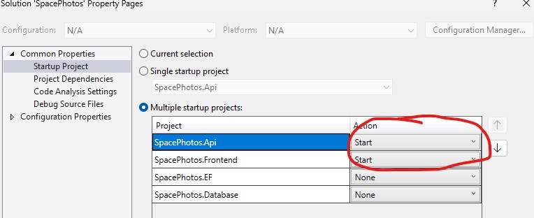
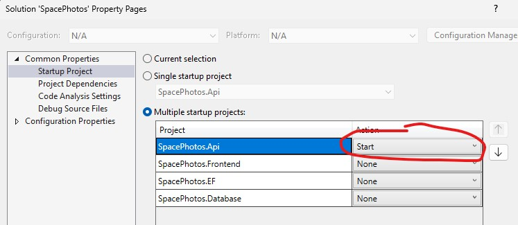

# Space photos
Hobby projekt který zobrazuje data získaná z NASA API.

## Technologie
- ASP.NET
- MS SQL
- React (Vite, Typescript)
- Entity framework

## Popis
Backend komunikuje s NASA API, a výsledky cachuje v databázi pro urychlení a omezení poètu požadavkù na cizí API.
Projekt nepoužívá EF migrace, ale SSDT projket s možností publikovat pøes profily.
Frontend je napsaný v Reactu (Vite) a používá napø. react-query.
Frontend a backend je rozdìlen do samostatných projektù csproj a esproj což umožòuje aktuální VisualStudio 2022.

## Seznam projektù v solution
- Api (backend)
- Database (SQL "SSDT" projekt)
- EF (v projektu jsou entity a dbcontext)
- Frontend (React frontend)

## Spuštìní projektu
- Pro spuštìní je potøeba založit databázi a publikovat SpacePhotos.Database projekt pøes publish profil v "Database" projektu.
- Dále je potøeba zmìnit connection string v appsettings.Development.json na tuto databázi.

Teï je možné projekt spustit z Visual Studia a to buï celý (backend i frontend) najednou. 
Nebo spustit jen backend a frontend si spustit ve VS code pomocí "npm run start"

To záleží na nastavení startup projektu:
Oboje

Pouze backend

## publish
publikování projektu jde standardnì pøes publish profil ve Visual Studiu